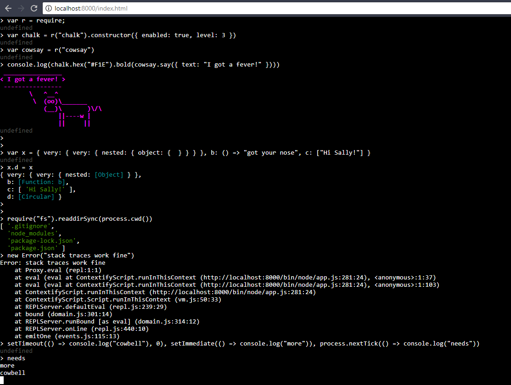

# node-in-browser
Run Nodejs In browser



## Contributor Quick Start

``` bash
git clone https://github.com/shahirturkmen/node-in-browser
npm install
npm run build
# npm run build -- -- -w     # to build in watch mode
npm start
```

This will serve the REPL at http://localhost:8000/index.html
